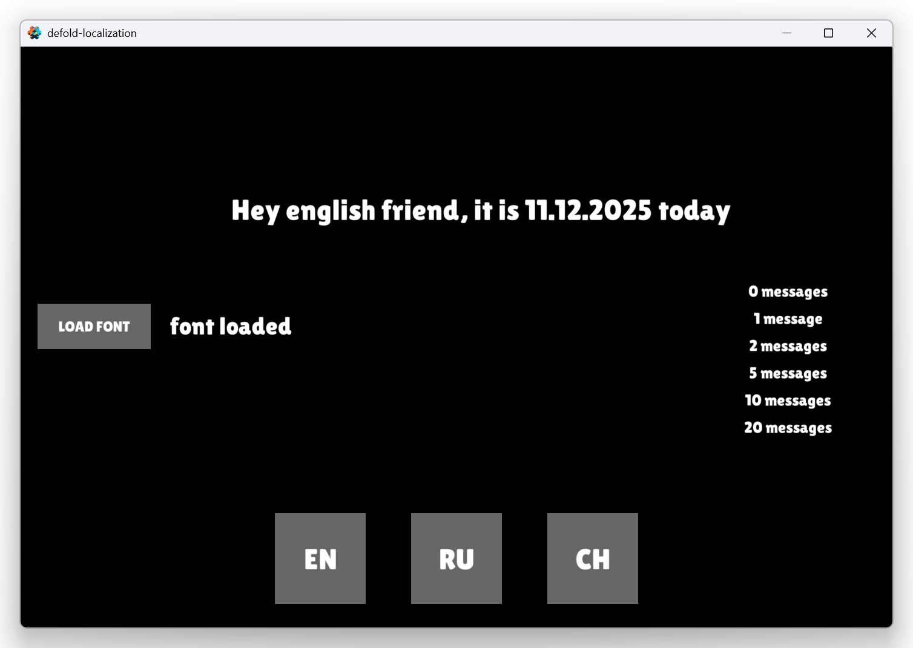
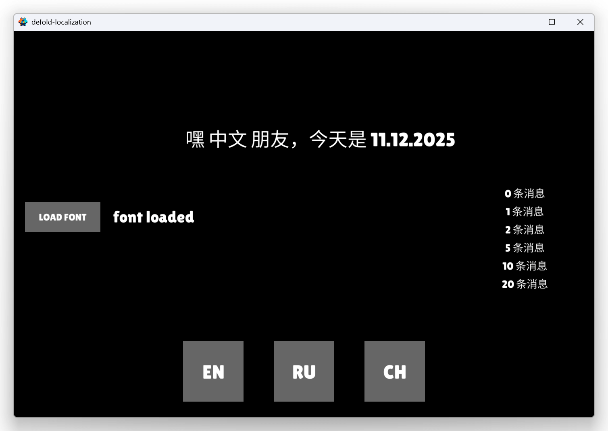
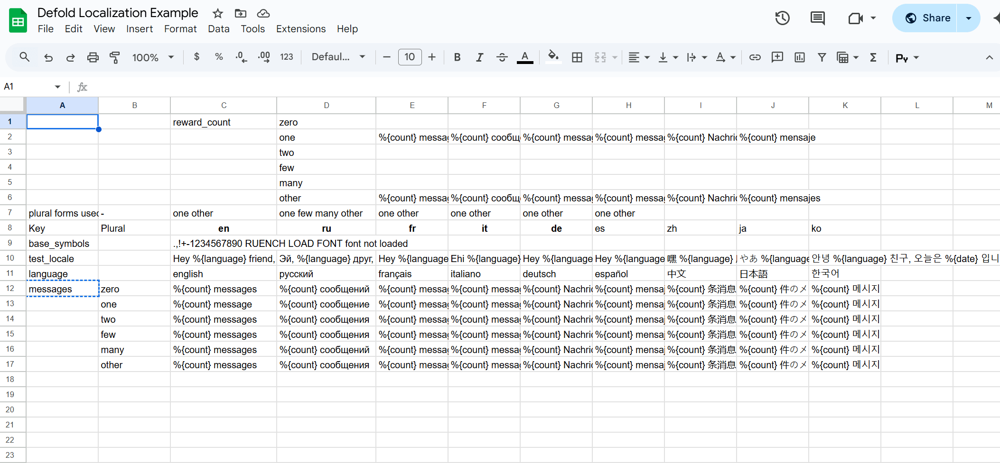

# Defold Localization example

This is example how to use google sheet table for localization.

Localization support plurals and placeholders.

Example use 2 fonts. One for all languages and one for set of languages without chinese, japanese and korean. You can run game with small font and use liveupdate to download full font.




## How to use


1. You will need credentials.json to download from google sheets.
[Make credentials](docs/credentials.md)

2. Copy localization folder in your project

 - Add files to .gitignore
```
/localization/load_localization/node_modules
/localization/load_localization/package-lock.json
/localization/load_localization/token.json
/localization/load_localization/credentials.json
/localization/load_localization/localization/**
```

- Install node dependencies.
```
cd localization/load_localization
npm install
```


3. Config index.js

	Paste your spreadsheet id to config_sheet variable.
Use you sheet name and range
```js
async function main(auth) {
    console.log("start");
    const sheets = google.sheets({version: 'v4', auth});
	//https://docs.google.com/spreadsheets/d/1BUmB7w0f4RVaqfJtRp3ix_3HKL0V5Izu-I9MB9NhCX4
    const config_sheet = "1BUmB7w0f4RVaqfJtRp3ix_3HKL0V5Izu-I9MB9NhCX4"
    let localization = await download_localization(sheets, "localization!A8:L1000", auth, config_sheet);
```
4. Download localization
```
cd ./localization/load_localization
node index.js
```
You will have 6 files.
- Font forge scripts to exclude symbols from ttf file.
	font_forge_all.txt
	font_forge_small.txt
- Localization data in json format. You will need localization_compact.json for your game.
	localization.json 
	localization_compact.json
- Symbols list in txt format. To include symbols in defold .font files
	symbol_list.txt
	symbol_list_small.txt

5. Google sheets localization
(https://docs.google.com/spreadsheets/d/1BUmB7w0f4RVaqfJtRp3ix_3HKL0V5Izu-I9MB9NhCX4/edit#gid=0)[Example spreadsheet]



//todo add image

6. Add localization_compact.json to custom resources

7. Use localization in your game. Look in localization.lua and main.gui_script for example.

```lua
--localization.lua
local I18N = require "localization.i18n.init"

local TAG = "[LOCALIZATION]"

---@class Localization
local M = {

}


function M:init(locale)
	self.config_all = localization.load_localization_from_resources("custom/localization_compact.json")
	self.config_tiny = {}
	for k, v in pairs(M.config_all) do
		if k ~= "ko" and k ~= "zh" and k ~= "ja" then
			self.config_tiny[k] = v
		end
	end
	I18N.load(self.config_tiny)
	I18N.setFallbackLocale("en")
	self:set_locale(assert(locale))
end

function M:set_locale(locale)
	print(TAG, "set locale:" .. locale)
	I18N.setLocale(locale)
    --you can create events or use messages to trigger components when language is changed
    --EVENTS.LANGUAGE_CHANGED:trigger()
end

function M:locale_get()
	return I18N.getLocale()
end

function M:translate(key, data)
	local translation = I18N.translate(key, data)
	if not translation then
		print(TAG, "translation not found:" .. key)
		return key
	end
	return translation
end

function M:is_exist(id)
	return I18N.translate(id) ~= nil
end

function M:on_font_loaded(font_all)
	self.font_all = assert(font_all)
	I18N.load(self.config_all)
    --add delay to fix some font not changed it metrics
	--timer.delay(0.1, false, function ()
	--	EVENTS.LANGUAGE_CHANGED:trigger()
	--end)
end

return M

--main.gui_script
local function on_language_changed(self)
	local language_str = LOCALIZATION:translate("language")
	local date_str = os.date("%d.%m.%Y")
	local test_locale = LOCALIZATION:translate("test_locale", {language = language_str, date = date_str})
	gui.set_text(gui.get_node("title"), test_locale)
	gui.set_text(gui.get_node("load_font_status"), LOCALIZATION.font_all and "font loaded" or "font not loaded")
	gui.set_text(gui.get_node("msg_zero"), LOCALIZATION:translate("messages", {count = 0}))
	gui.set_text(gui.get_node("msg_one"), LOCALIZATION:translate("messages", {count = 1}))
	gui.set_text(gui.get_node("msg_two"), LOCALIZATION:translate("messages", {count = 2}))
	gui.set_text(gui.get_node("msg_few"), LOCALIZATION:translate("messages", {count = 5}))
	gui.set_text(gui.get_node("msg_many"), LOCALIZATION:translate("messages", {count = 10}))
	gui.set_text(gui.get_node("msg_other"), LOCALIZATION:translate("messages", {count = 20}))
end
```

